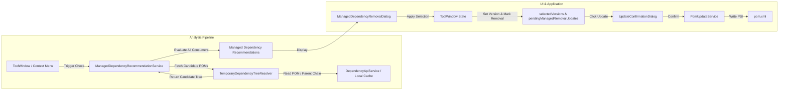

# Requirements

### Overview & Goals
When maintaining Maven projects, developers often pin specific dependency versions in `<dependencyManagement>` to force a newer or patched version. Over time, when parent POMs or direct dependencies are upgraded to newer releases, they frequently include that desired version (or an even newer version) transitively. In such cases, the manual `<dependencyManagement>` entry becomes redundant and can be safely removed, simplifying the `pom.xml` and reducing maintenance burden.

The goal of this feature is to automatically detect when upgrading a parent POM (`<parent>`) or a direct dependency (`<dependencies><dependency>`) makes a managed dependency redundant, formulate a clear recommendation to the user, and allow them to apply the version upgrade and mark the managed dependency for removal with a single click before executing the update via the standard confirmation workflow.

### Scope
- **In Scope**:
  - Scanning declared managed dependencies in the project's `<dependencyManagement>`.
  - Fetching/resolving candidate POMs for newer available versions of parent POMs and direct dependencies.
  - Constructing a lightweight temporary dependency tree in memory to evaluate transitive versions provided by candidate versions.
  - Multi-consumer validation: ensuring that if a managed dependency is used transitively by multiple dependencies, **all** consumer paths provide a compatible version (`>=` current version) under the upgrade.
  - Generating human-readable recommendations ("Du kannst die ManagedDependency x entfernen, wenn du das Parent y oder die Dependency z in der Version v nutzt...").
  - Presenting recommendations in a dedicated recommendation dialog accessible via toolbar and context menu.
  - Applying accepted recommendations by setting the component's target version and marking the managed dependency for removal (`removeFromPom = true`).
  - Integration with the existing "Update" action, `UpdateConfirmationDialog`, and `PomUpdateService`.
- **Out of Scope**:
  - Automatically removing unmanaged direct dependencies.
  - Modifying external repositories or parent POMs outside the current project workspace.
  - Auto-applying changes without explicit user confirmation in the dialog and subsequent Update confirmation.

### User Stories
- **US-1**: As a developer, I want MavenUp to inform me if upgrading my parent POM (e.g. `spring-boot-starter-parent` from `3.1.0` to `3.2.0`) allows me to remove redundant managed dependencies (e.g. `jackson-databind`), so that my POM remains clean.
- **US-2**: As a developer, I want to be certain that a managed dependency is only marked for removal if all dependencies transitively using it are satisfied with the new version, preventing unintended version downgrades or conflicts.
- **US-3**: As a developer, I want to accept recommendations via an intuitive dialog and see the resulting version bumps and removals reflected in the MavenUp table and the Update confirmation dialog before changes are written to `pom.xml`.

### Functional Requirements
- **FR-1**: The system shall analyze candidate versions for parent POMs and direct dependencies available in configured repositories.
- **FR-2**: The system shall build an in-memory temporary dependency graph for candidate versions using a dedicated POM tree resolver without modifying project files.
- **FR-3**: The system shall identify managed dependencies where all consumer dependency paths in the upgraded state provide a transitive version greater than or equal to (`>=`) the currently pinned managed dependency version.
- **FR-4**: If a managed dependency is consumed across multiple distinct dependency trees, the system shall strictly verify that all consumers provide the compatible version before recommending removal.
- **FR-5**: The system shall offer a toolbar button and a context menu entry ("Check Managed Dependency Cleanup Recommendations...") in the MavenUp Tool Window.
- **FR-6**: The system shall open an interactive recommendation dialog displaying:
  - Managed dependency coordinate (`groupId:artifactId`) and current version.
  - Triggering component (`parent` or `dependency`) and recommended target version.
  - Summary explanation text and details of all affected consumer paths.
- **FR-7**: Upon clicking "Apply Recommendation", the tool shall set the triggering component's selected version to the candidate target version and mark the managed dependency as pending removal (`removeFromPom = true`).
- **FR-8**: The user can then click the existing "Update" button, review the combined changes in `UpdateConfirmationDialog`, and apply them to `pom.xml` via `PomUpdateService`.

# Technical Design

### Current Implementation
- `DependencyHierarchyService`: Builds inclusion and hierarchy trees for existing dependencies using the workspace's resolved `MavenProject.dependencyTree`.
- `DependencyApiService` / `VersionMetadataCache`: Fetches and caches available versions from Maven Central and private repositories configured in `settings.xml`.
- `PomUpdateService`: Modifies `pom.xml` via PSI, supporting version bumps as well as deletion or commenting-out of managed dependencies when `removeFromPom = true`.
- `MavenUpWindowFactory`: Central ToolWindow managing table state (`knownDependencies`, `selectedVersions`, `pendingManagedRemovalUpdates`), toolbar actions, and context menus.
- `UpdateConfirmationDialog`: Previews pending updates and removals before writing to disk.

### Key Decisions
1. **Dedicated In-Memory POM Tree Resolver**:
   - *Decision*: Implement `TemporaryDependencyTreeResolver` to parse POMs of candidate versions directly from local cache and remote repositories.
   - *Rationale*: Avoids complex virtual Maven project instantiation in IntelliJ while remaining fast, isolated, and strictly read-only.
2. **Recommendation Presentation via Dedicated Dialog & Context Menu**:
   - *Decision*: Provide a toolbar action and table context menu action opening `ManagedDependencyRemovalDialog`.
   - *Rationale*: Offers maximum clarity for complex transitive explanations, allows multi-recommendation selection, and prevents cluttering the main table.
3. **Version Compatibility Rule (`>= currentVersion`)**:
   - *Decision*: Consider a managed dependency redundant if all transitive consumers in the candidate version state provide at least the current version (`ComparableVersion(transitive) >= ComparableVersion(current)`).
   - *Rationale*: Maximizes POM modernization without introducing version regressions.
4. **Integration with Existing Update Pipeline**:
   - *Decision*: Applying a recommendation updates `selectedVersions` and registers a removal in `pendingManagedRemovalUpdates`.
   - *Rationale*: Reuses MavenUp's robust, property-aware update and confirmation pipeline without introducing redundant write paths.

### Architecture Diagram


### Proposed Changes & Components

#### 1. Data Models (`de.schwarzland.mavenup.model`)
- **`ManagedDependencyRemovalRecommendation`**:
  ```kotlin
  data class ManagedDependencyRemovalRecommendation(
      val managedGroupId: String,
      val managedArtifactId: String,
      val managedCurrentVersion: String,
      val triggerGroupId: String,
      val triggerArtifactId: String,
      val triggerType: String, // "parent" or "dependency"
      val triggerCurrentVersion: String,
      val triggerTargetVersion: String,
      val transitiveVersionInTarget: String,
      val consumers: List<ConsumerDependencyInfo>,
      val isSatisfiedAcrossAllConsumers: Boolean
  )

  data class ConsumerDependencyInfo(
      val groupId: String,
      val artifactId: String,
      val resolvedVersion: String,
      val pathDescription: String
  )
  ```
- **`TemporaryDependencyNode`**: Lightweight graph node representing an artifact and its transitive dependencies parsed from candidate POMs.

#### 2. Services (`de.schwarzland.mavenup.service`)
- **`TemporaryDependencyTreeResolver`**:
  - Loads candidate POM XMLs (from local `~/.m2/repository` or via HTTP from Maven Central / private repositories).
  - Recursively resolves `<parent>` tags and interpolates `${...}` properties.
  - Extracts `<dependencies>` and `<dependencyManagement>` to construct the effective dependency tree for candidate versions.
  - Features depth limits and cycle detection.
- **`ManagedDependencyRecommendationService`**:
  - Gathers all managed dependencies from the project's `<dependencyManagement>`.
  - Finds all direct dependencies and parent POMs with available newer versions.
  - Invokes `TemporaryDependencyTreeResolver` for candidate versions.
  - Checks if the managed dependency is provided by the candidate component and whether all consumer dependencies receive version `>= currentVersion`.
  - Formulates actionable recommendation objects.

#### 3. UI Components (`de.schwarzland.mavenup.ui`)
- **`ManagedDependencyRemovalDialog`**:
  - `DialogWrapper` showing recommendations with detailed explanation texts, consumer comparison lists, and checkboxes to select recommendations.
  - "Apply Selected Recommendations" button.
- **`MavenUpWindowFactory` Integration**:
  - Adds toolbar action `CheckManagedDependencyRemovalAction` and context menu item.
  - On recommendation apply: sets `selectedVersions[triggerKey] = triggerTargetVersion` and calls `markManagedEntryForRemoval(managedKey, managedType, managedCurrentVersion)`.
  - Triggers table repaint and activates the Update button.

### File Structure Changes
- **New Files**:
  - `src/main/kotlin/de/schwarzland/mavenup/model/ManagedDependencyRemovalRecommendation.kt`
  - `src/main/kotlin/de/schwarzland/mavenup/service/TemporaryDependencyTreeResolver.kt`
  - `src/main/kotlin/de/schwarzland/mavenup/service/ManagedDependencyRecommendationService.kt`
  - `src/main/kotlin/de/schwarzland/mavenup/ui/ManagedDependencyRemovalDialog.kt`
  - `src/test/kotlin/de/schwarzland/mavenup/service/TemporaryDependencyTreeResolverTest.kt`
  - `src/test/kotlin/de/schwarzland/mavenup/service/ManagedDependencyRecommendationServiceTest.kt`
  - `src/test/kotlin/de/schwarzland/mavenup/ui/ManagedDependencyRemovalDialogTest.kt`
  - `docs/features/managed-dependency-removal.md`
- **Modified Files**:
  - `src/main/kotlin/de/schwarzland/mavenup/ui/MavenUpWindowFactory.kt` (action & context menu integration)
  - `src/main/resources/messages/MyMessageBundle.properties` (I18n strings)
  - `README.md`, `FEATURES.md`, `docs/usage.md`, `docs/architecture.md`, `CHANGELOG.md`
  - `.github/copilot-project-context.md`, `.github/context/components-service.md`, `.github/context/components-ui-dialogs.md`

# Testing

### Validation Approach
Automated unit and integration testing using JUnit 5 / JUnit 4 and IntelliJ `BasePlatformTestCase` to ensure high test coverage without network dependencies by using mock POM resolvers and PSI models.

### Key Scenarios
1. **Single Direct Dependency Upgrade Redundancy**:
   - Given a POM with managed dependency `x:1.0.0` and direct dependency `y:1.0.0`.
   - When `y` has candidate version `2.0.0` which transitively includes `x:1.0.0` (or `x:1.2.0`).
   - Verify that `ManagedDependencyRecommendationService` generates a recommendation to upgrade `y` to `2.0.0` and remove `x`.
2. **Parent POM Upgrade Redundancy**:
   - Given a POM with parent `p:1.0.0` and managed dependency `x:1.0.0`.
   - When parent `p:2.0.0` includes `x:1.0.0` in its `<dependencyManagement>`.
   - Verify that recommendation is emitted for parent `p`.
3. **Multi-Consumer Consistency (Positive Case)**:
   - Given managed dependency `x` used transitively by both `y` and `z`.
   - When upgrading parent `p` to `2.0.0` results in both `y` and `z` receiving `x >= 1.0.0`.
   - Verify recommendation is generated.
4. **Multi-Consumer Inconsistency (Negative Case)**:
   - Given managed dependency `x:2.0.0` used transitively by `y` and `z`.
   - When upgrading `y` brings `x:2.0.0` but `z` still uses `x:1.0.0` and is not upgraded.
   - Verify NO recommendation is generated, preventing partial downgrade.
5. **Dialog & Tool Window Workflow**:
   - User opens recommendation dialog, selects a recommendation, and clicks Apply.
   - Verify that `selectedVersions` contains the upgraded component version and `pendingManagedRemovalUpdates` contains the managed dependency.
   - Verify `UpdateConfirmationDialog` displays the upgrade and removal correctly.
   - Verify `PomUpdateService` successfully modifies `pom.xml`.

### Edge Cases
- Candidate POM contains property placeholders (`${spring.version}`) in dependencies: verified through resolver property interpolation.
- Cyclic dependencies in candidate POMs: verified with cycle detection visiting set.
- Candidate POM cannot be fetched or parsed: graceful error handling without crashing UI or scan.
- Managed dependency already marked for removal or version reset: state synchronization handled properly.

# Delivery Steps

###   Step 1: Implement Temporary Dependency Tree & POM Resolution Service
A dedicated resolver parses and builds effective dependency trees for candidate artifact coordinates in memory without altering project files.

- Create `TemporaryDependencyNode` and `TemporaryArtifactCoordinate` models to represent candidate POM dependency trees.
- Implement `TemporaryDependencyTreeResolver` in `de.schwarzland.mavenup.service` to fetch and parse candidate POMs (via local `~/.m2/repository` and configured remote Maven repositories through `DependencyApiService`).
- Support recursive `<parent>` resolution, property placeholder substitution (`${...}`), and `<dependencyManagement>` inheritance within candidate POMs.
- Add cycle detection and traversal depth limits to guarantee deterministic and non-blocking performance.
- Add unit tests in `TemporaryDependencyTreeResolverTest` validating POM parsing, property interpolation, parent POM chains, and multi-level transitive resolution.

###   Step 2: Implement Managed Dependency Recommendation Engine
An analysis service evaluates whether managed dependencies are rendered redundant by parent or dependency version upgrades across all consumers.

- Create `ManagedDependencyRemovalRecommendation` data model in `de.schwarzland.mavenup.model` holding the managed dependency, triggering component upgrade, target version, transitive version, and consumer dependency details.
- Implement `ManagedDependencyRecommendationService` in `de.schwarzland.mavenup.service`.
- Implement detection logic: for each declared managed dependency, inspect all project consumer paths and check if upgrading a parent POM or direct dependency to an available newer candidate version provides the managed dependency transitively in a version `>= currentVersion`.
- Verify the multi-consumer condition: ensure a recommendation is ONLY emitted if ALL dependencies consuming the managed dependency transitively receive the compatible version.
- Add comprehensive unit tests in `ManagedDependencyRecommendationServiceTest` covering single-consumer, multi-consumer matching, multi-consumer version conflicts (no recommendation), parent upgrades, and direct dependency upgrades.

###   Step 3: Implement Recommendation Dialog UI & Interaction
An interactive DialogWrapper presents detailed cleanup recommendations with rationale, version comparisons, and one-click application.

- Implement `ManagedDependencyRemovalDialog` in `de.schwarzland.mavenup.ui` displaying a table/tree of detected recommendations.
- Include structured explanation text ("You can remove managed dependency X if you upgrade parent/dependency Y to version V...").
- Detail all affected consumer dependencies and their transitive versions under the candidate target version.
- Provide clear selection controls and an "Apply Selected Recommendations" action that delegates to the ToolWindow state handler.
- Add unit tests in `ManagedDependencyRemovalDialogTest` verifying dialog rendering, selection state handling, and callback triggering.

###   Step 4: Integrate Recommendation Workflow into Tool-Window & Update Action
The Tool-Window integrates the recommendation analysis into the toolbar and context menu, linking directly into the existing Update & Confirm workflow.

- Add a toolbar action / icon and table context menu entry ("Check Managed Dependency Cleanup Recommendations...") in `MavenUpWindowFactory.kt` and `MyToolWindow`.
- Execute analysis in a background task with progress indication without blocking the EDT.
- Upon user confirmation in the recommendation dialog, update `selectedVersions` for the triggering component and call `markManagedEntryForRemoval(...)` for the redundant managed dependency.
- Ensure the existing "Update" button activates, and `UpdateConfirmationDialog` correctly shows both the component version bump and the managed dependency removal (`willRemove` / `willCommentOut`).
- Add integration tests in `MavenUpWindowFactoryTest` verifying toolbar action triggering, recommendation application, state synchronization, and final POM update persistence.

###   Step 5: Documentation, Localization & Quality Assurance
All user-facing and architectural documentation, localized strings, project context files, and code quality checks are fully updated.

- Add localized string keys in `MyMessageBundle.properties` (and German localization if present) for dialog titles, table headers, explanations, and context menu items.
- Document the new feature in `docs/features/managed-dependency-removal.md`, update `FEATURES.md`, and update `docs/usage.md` and `docs/architecture.md`.
- Update `.github/copilot-project-context.md`, `.github/context/components-service.md`, and `.github/context/components-ui-dialogs.md`.
- Add CHANGELOG entry under `Added` in `CHANGELOG.md` and update `plugin.xml` description if appropriate.
- Run `check`, `detekt`, and `koverXmlReport` to verify code quality and complete test coverage.